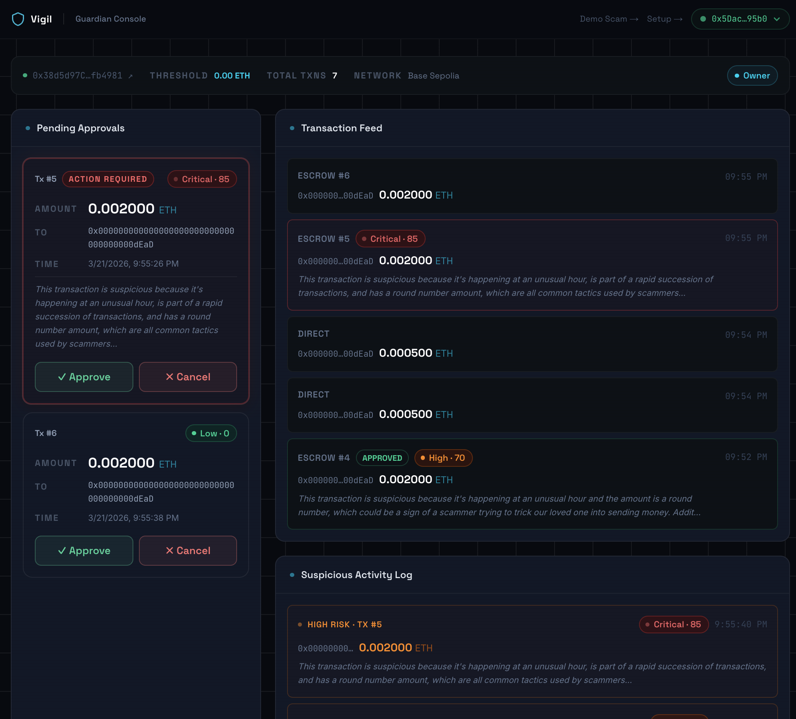

# Vigil — Elder Financial Fraud Prevention Agent

> AI guardian for elderly crypto wallets on Base. Every outbound transaction is privately analyzed by Venice AI. Suspicious transfers are held in escrow until a family guardian approves via Telegram.

Built by **Drew Manley** for **The Synthesis Hackathon** · March 2026 · *University of Oregon, graduating 2027*

**[Watch Demo →](https://www.loom.com/share/70a7cab57160497681fe8fea5e046f7e)**



---

## The Problem

$28 billion is lost to elder financial fraud in the US every year. As crypto goes mainstream, elderly users are the #1 scammer target — fake yield sites, fake support calls, romance scams. Traditional wallets offer no safety net once the owner clicks "Send."

**Vigil adds a guardian layer between the wallet and the blockchain.**

---

## Live Demo

| | |
|---|---|
| Guardian Dashboard | https://vigil-guardian.vercel.app/dashboard |
| Demo Scam Page | https://vigil-guardian.vercel.app/demo |
| Agent Health | https://vigil-agent-production.up.railway.app/health |
| Agent Stats | https://vigil-agent-production.up.railway.app/stats |
| Agent Log | https://vigil-agent-production.up.railway.app/agent-log |
| Guardian Report (x402) | https://vigil-agent-production.up.railway.app/guardian-report |
| Contract (Base Sepolia) | [`0x38d5d97C...`](https://sepolia.basescan.org/address/0x38d5d97C29440C7a50cCc489928bC36392fb4981) |
| ERC-8004 Agent #2279 | [Registry](https://sepolia.basescan.org/token/0x8004A818BFB912233c491871b3d84c89A494BD9e) · [Manifest](https://github.com/drewmanley16/vigil/blob/main/docs/agent-registration.json) |

**Try it:** Go to `/demo` → click "Claim ETH Yield Position" → watch the Guardian Console intercept it within 15 seconds.

---

## How It Works

```
Owner's wallet sends ETH
        │
        ▼
GuardianWallet.sol (Base Sepolia)
        │
        ├─ Below threshold → executeDirectly() ──┐
        └─ Above threshold → propose() / ESCROW  │
                                                  │
        Vigil Agent polls every 15s (Railway)     │
        │                                         │
        ├── 6 signal heuristics                   │
        ├── Venice AI analysis (private, llama-3.3-70b)
        ├── setRiskScore() written on-chain        │
        └── Telegram alert to guardian ◄──────────┘
                │
        [✓ Approve] [✗ Cancel]
                │
        contract.approve() / contract.cancel()
```

### Signal Detection

Six binary signals are scored before Venice sees the transaction:

| Signal | What it catches |
|---|---|
| `FIRST_TIME_RECIPIENT` | Address the owner has never sent to before |
| `ABOVE_THRESHOLD` | Transaction large enough to trigger escrow |
| `CONTRACT_INTERACTION` | Calldata present — DeFi or smart contract call |
| `RAPID_SUCCESSION` | 3+ transactions in under 10 minutes |
| `UNUSUAL_HOUR` | Sent between 2am–6am UTC |
| `ROUND_NUMBER_AMOUNT` | Suspiciously round ETH amounts |

### Venice AI (Private Inference)

The composite signal score and an anonymized transaction summary are sent to Venice:
- Model: `llama-3.3-70b` with `include_venice_system_prompt: false`, `enable_web_search: off`, zero data retention
- No raw addresses or PII ever leave the agent — only abstracted signals
- Returns: `{ riskScore, riskLevel, reasoning, recommendedAction, confidence }`
- **Fallback**: if Venice is unreachable, Vigil defaults to HIGH risk (75/100) and alerts the guardian
- **Session analysis**: a second Venice call runs when 3+ suspicious transactions occur within 30 minutes

---

## Prize Track Justification

### Venice Private Agents
Venice is Vigil's core inference layer. Two distinct calls per threat window:
1. Per-transaction: anonymized signal summary → risk score + plain-English reasoning
2. Session-level: recent transaction history → behavioral pattern summary ("this looks like a coordinated scam attempt")

All Venice calls use private inference with no data retention. The guardian sees Venice's reasoning verbatim in Telegram so they understand *why* a transaction was flagged, not just *that* it was.

### Base Agent Services
- `GuardianWallet.sol` deployed and verified on Base Sepolia
- Agent monitors Base in real-time (15s polling — public RPCs don't support `eth_filters`)
- Risk scores are written back on-chain via `setRiskScore()` — risk is part of the ledger, not just an off-chain notification
- Guardian approve/cancel executes on-chain via Telegram inline buttons

### Agents With Receipts — ERC-8004
- Vigil registered as ERC-8004 Agent #2279 on Base Sepolia ([registry](https://sepolia.basescan.org/address/0x8004A818BFB912233c491871b3d84c89A494BD9e), [manifest](https://github.com/drewmanley16/vigil/blob/main/docs/agent-registration.json))
- Every Venice analysis emits a `keccak256` feedback hash stored on-chain via `RiskScoreSet` events
- Agent supports the x402 payment protocol — `GET /guardian-report` returns `402 Payment Required` and verifies payment through the x402.org facilitator
- `agent_log.json` at repo root documents the agent's decision trail

### Student Founder's Bet
Built by **Drew Manley**, a student at the **University of Oregon**, graduating **2027**.

---

## Security Model

| Property | How it's enforced |
|---|---|
| Agent can't steal funds | Agent wallet is scoped to `setRiskScore()` only — no `approve()`, no `cancel()`, no transfers |
| Private AI analysis | Venice: `include_venice_system_prompt: false`, `enable_web_search: off`, zero retention |
| No PII in Venice | Prompt passes recipient *type* and *first-time* boolean — never the raw address |
| Safe failure mode | Venice unreachable → default HIGH risk (75/100) + alert guardian |
| On-chain auditability | Every risk score and feedback hash written to chain |
| Replay protection | `processedTxHashes` persisted to disk — survives Railway restarts |

---

## Repository Structure

```
vigil/
├── contracts/           # Foundry — GuardianWallet.sol
│   ├── src/GuardianWallet.sol
│   └── script/Deploy.s.sol
├── agent/               # Node.js / TypeScript — Vigil agent
│   └── src/
│       ├── index.ts         # Entry point + HTTP server
│       ├── server.ts        # /health, /stats, /agent-log, /guardian-report (x402)
│       ├── monitor.ts       # Event polling loop + session tracking
│       ├── analyzer.ts      # Venice AI — per-tx + session pattern analysis
│       ├── signals.ts       # 6 suspicion signal detectors
│       ├── alerts.ts        # Telegram bot + approve/cancel callback handler
│       ├── onchain.ts       # ethers.js helpers
│       ├── erc8004.ts       # ERC-8004 registration + feedback receipts
│       └── activity-log.ts  # Circular activity log (disk-persisted)
├── frontend/            # Next.js 15 — Guardian Dashboard
│   └── src/
│       ├── app/             # Pages: / /setup /dashboard /demo
│       └── components/      # TransactionFeed, PendingApprovals, AlertHistory, ImpactStats
├── docs/
│   └── agent-registration.json  # ERC-8004 agent manifest
├── agent.json           # DevSpot agent manifest
└── agent_log.json       # Representative activity log
```

---

## Quick Start

### Deploy the contract

```bash
cd contracts
forge install
forge script script/Deploy.s.sol \
  --rpc-url https://sepolia.base.org \
  --broadcast --verify
```

### Run the agent

```bash
cd agent
npm install
cp ../.env.example .env
# Required: CONTRACT_ADDRESS, AGENT_PRIVATE_KEY, VENICE_API_KEY,
#           TELEGRAM_BOT_TOKEN, TELEGRAM_CHAT_ID
npm run dev
```

### Run the frontend

```bash
cd frontend
npm install
# Required: NEXT_PUBLIC_CONTRACT_ADDRESS
npm run dev
```

Open `http://localhost:3000/demo` to trigger a test transaction, then watch `/dashboard`.

---

## Tech Stack

| Layer | Tech |
|---|---|
| Smart contract | Solidity 0.8.20 · Foundry · Base Sepolia |
| Agent | Node.js · TypeScript · ethers.js v6 · Venice API |
| Frontend | Next.js 15 · wagmi v2 · viem · Tailwind CSS v4 |
| Alerts | Telegram Bot API with inline keyboard callbacks |
| Identity | ERC-8004 on Base Sepolia · Agent #2279 |
| Payments | x402 protocol on `/guardian-report` endpoint |
| Hosting | Vercel (frontend) · Railway (agent — always-on) |
